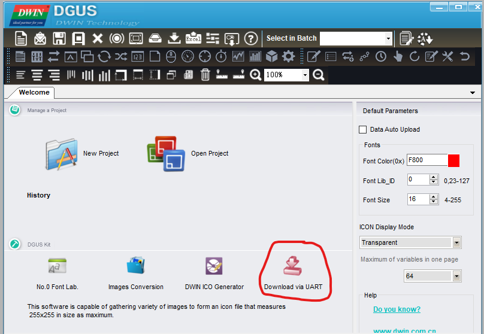
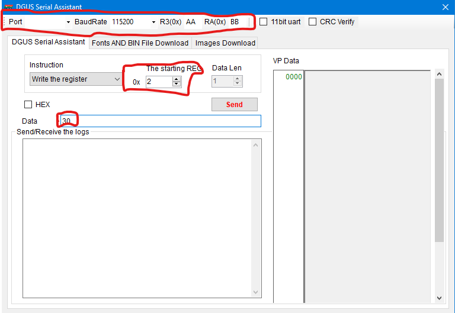

# DGUS DWIN screen example

This code is written and tested on the arduino mega 2560 together with the DMT48270T043_03W of DWIN.

Make sure that the TTL/CMOS pad is soldered on the screen (found on the back of the screen, below the ribbon cable).

## Testing
Before you test this example, test the screen with the built in tool of the DGUS software.

Make sure to fill in the correct variables at the top

In this example the buzzer is being actuated.

## Example
In the example a basic icon pack with 2 pictures is included. This are both a green and a red circle. If pin 52 of the arduino mega is set high the red circle will appear, if the pin is pulled low, the green circle will appear. The `display_write_variable` function is an example of how you could build and send the data to the screen. 

## Problems?
If you have any problems with this example, feel free to make an issue or contact me [wouter.heerwegh@formulaelectric.be](mailto:wouter.heerwegh@formulaelectric.be)
